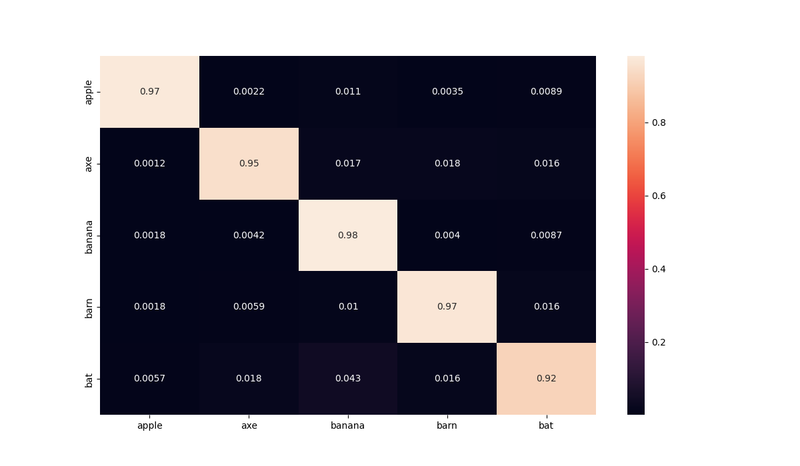

<p align="center">
 <h1 align="center">Ứng dụng Quick Draw với Nhận diện Cử chỉ Tay</h1>
</p>

## Giới thiệu

Dự án này là một ứng dụng vẽ tương tác sử dụng camera webcam kết hợp với nhận diện cử chỉ tay thông qua MediaPipe và mô hình nhận diện hình vẽ được đào tạo từ bộ dữ liệu QuickDraw.

## Demo

<p align="center">
  <br/>
  <i>Camera app demo</i>
</p>

## Tính năng chính

- Vẽ bằng ngón tay thông qua camera webcam
- Nhận diện cử chỉ tay để chọn màu sắc và công cụ vẽ
- Xóa vùng vẽ bằng công cụ tẩy
- Nhận diện hình vẽ theo thời gian thực
- Hỗ trợ nhiều màu sắc khác nhau

## Cách sử dụng

1. **Chế độ vẽ:**
   - Giơ ngón trỏ lên (ngón giữa cụp xuống) để vẽ
   - Giơ cả ngón trỏ và ngón giữa lên để chọn công cụ và màu sắc
   - Đưa ngón trỏ và ngón giữa gần nhau để chọn màu/công cụ từ thanh công cụ

2. **Nhận diện hình vẽ:**
   - Nhấn phím Space để chuyển đổi giữa chế độ vẽ và chế độ nhận diện
   - Khi ở chế độ nhận diện, hệ thống sẽ xử lý và nhận diện hình vẽ của bạn
   - Nhấn Space lần nữa để xóa hình vẽ và quay lại chế độ vẽ

3. **Thoát ứng dụng:**
   - Nhấn phím 'q' để thoát khỏi ứng dụng

## Cấu trúc dự án

```
.
├── camera_app.py         # Ứng dụng chính với camera
├── painting_app.py       # Phiên bản đơn giản của ứng dụng vẽ
├── train.py              # Script huấn luyện mô hình QuickDraw
├── src/                  # Thư mục mã nguồn
│   ├── config.py         # Cấu hình và danh sách các lớp
│   ├── model.py          # Định nghĩa mô hình CNN cho QuickDraw
│   ├── utils.py          # Các hàm tiện ích
│   └── ...
├── header/               # Thư mục chứa hình ảnh thanh công cụ
├── images/               # Thư mục chứa hình ảnh của các lớp QuickDraw
├── data/                 # Dữ liệu huấn luyện
└── checkpoint/           # Mô hình đã huấn luyện
```

## Cài đặt

1. Cài đặt các thư viện cần thiết:

```bash
pip install -r requirements.txt
```

2. Chạy ứng dụng:

```bash
python camera_app.py
```

## Tùy chọn dòng lệnh

```
python camera_app.py [options]

Options:
  --model-path, -m       Đường dẫn tới mô hình (mặc định: "checkpoint/best_model.pth")
  --header-path, -hp     Đường dẫn tới thư mục hình ảnh thanh công cụ (mặc định: "header")
  --image-path, -ip      Đường dẫn tới thư mục hình ảnh kết quả (mặc định: "images")
  --brush-thickness, -b  Độ dày của bút vẽ (mặc định: 15)
  --eraser-thickness, -e Độ dày của cục tẩy (mặc định: 30)
```

## Các lớp nhận diện

Hệ thống hiện tại hỗ trợ nhận diện các lớp sau:

- apple (táo)
- axe (rìu)
- banana (chuối)
- barn (nhà kho)
- bat (dơi)

## Thử nghiệm



## Bộ dữ liệu

Bộ dữ liệu được sử dụng để huấn luyện mô hình có thể tìm thấy tại [Bộ dữ liệu Quick Draw](https://console.cloud.google.com/storage/browser/quickdraw_dataset/sketchrnn). Ở đây tôi chỉ chọn 5 tệp cho 5 danh mục.

## Yêu cầu hệ thống

- Python 3.7+
- Webcam
- Đủ ánh sáng để nhận diện tay
