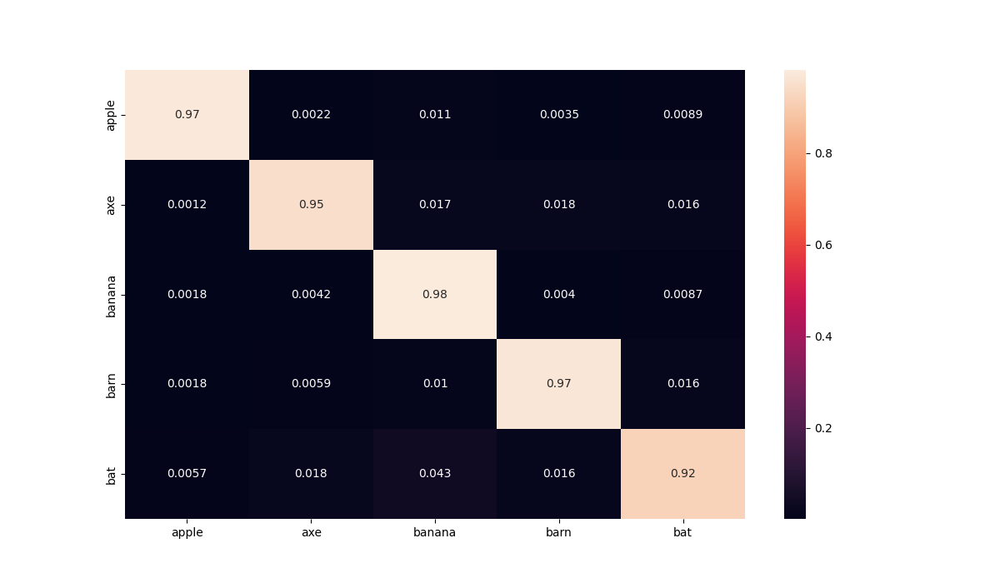

<p align="center">
 <h1 align="center">Quick Draw App with Hand Gesture Recognition</h1>
</p>

## Introduction

This project is an interactive drawing app that uses a webcam together with hand gesture recognition via MediaPipe and a drawing recognition model trained on the QuickDraw dataset.

## Demo

<p align="center">
  <br/>
  <i>Camera app demo</i>
</p>

## Main Features

* Draw using your finger through the webcam
* Recognize hand gestures to select colors and drawing tools
* Erase drawings using an eraser tool
* Real-time drawing recognition
* Support for multiple colors

## How to Use

1. **Drawing Mode:**

   * Raise your index finger (middle finger down) to draw
   * Raise both index and middle fingers to choose a tool or color
   * Bring the index and middle fingers close together to select from the toolbar

2. **Drawing Recognition:**

   * Press the Space key to switch between drawing and recognition mode
   * In recognition mode, the system will process and identify your drawing
   * Press Space again to clear the canvas and return to drawing mode

3. **Exit the App:**

   * Press the 'q' key to quit the application

## Project Structure

```
.
├── camera_app.py         # Main camera application
├── painting_app.py       # Simple drawing app version
├── train.py              # QuickDraw model training script
├── src/                  # Source code folder
│   ├── config.py         # Configurations and class list
│   ├── model.py          # CNN model definition for QuickDraw
│   ├── utils.py          # Utility functions
│   └── ...
├── header/               # Toolbar images
├── images/               # QuickDraw class images
├── data/                 # Training data
└── checkpoint/           # Trained model
```

## Installation

1. Install required libraries:

```bash
pip install -r requirements.txt
```

2. Run the app:

```bash
python camera_app.py
```

## Command Line Options

```
python camera_app.py [options]

Options:
  --model-path, -m       Path to the model (default: "checkpoint/best_model.pth")
  --header-path, -hp     Path to the toolbar image folder (default: "header")
  --image-path, -ip      Path to the result image folder (default: "images")
  --brush-thickness, -b  Brush thickness (default: 15)
  --eraser-thickness, -e Eraser thickness (default: 30)
```

## Recognized Classes

The current system supports recognition of the following classes:

* apple
* axe
* banana
* barn
* bat

## Experiment



## Dataset

The dataset used to train the model can be found at [Quick Draw Dataset](https://console.cloud.google.com/storage/browser/quickdraw_dataset/sketchrnn).
Only 5 files for 5 categories are selected here.

## System Requirements

* Python 3.7+
* Webcam
* Good lighting for hand recognition
